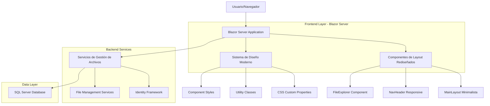
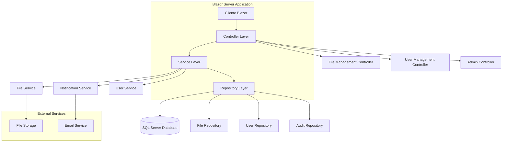
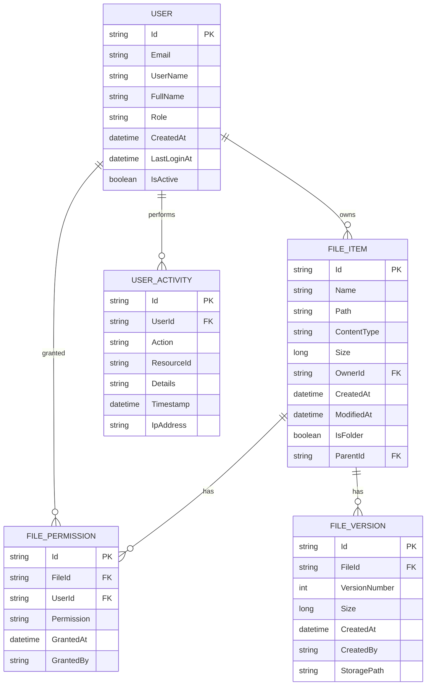

# Arquitectura Técnica - Rediseño OutCom File Manager

## 1. Diseño de Arquitectura



## 2. Descripción de Tecnologías

- **Frontend**: Blazor Server + CSS Moderno (Custom Properties + Utility Classes)
- **Backend**: ASP.NET Core 8.0 + Entity Framework Core
- **Base de Datos**: SQL Server (existente)
- **Autenticación**: ASP.NET Core Identity (existente)
- **Estilos**: CSS Puro sin frameworks externos (eliminando Bootstrap)

## 3. Definiciones de Rutas

| Ruta | Propósito |
|------|----------|
| / | Dashboard principal con vista general del gestor de archivos |
| /files | Explorador de archivos principal con navegación de carpetas |
| /files/details/{id} | Vista detallada de archivo específico con previsualización |
| /admin | Panel de administración para gestión de usuarios y sistema |
| /admin/users | Gestión específica de usuarios y permisos |
| /profile | Perfil de usuario con configuración personal |
| /account/login | Página de inicio de sesión rediseñada |
| /account/register | Página de registro de nuevos usuarios |

## 4. Definiciones de API

### 4.1 APIs Principales

**Gestión de Archivos**
```
GET /api/files
```

Request:
| Nombre Parámetro | Tipo Parámetro | Requerido | Descripción |
|------------------|----------------|-----------|-------------|
| path | string | false | Ruta de la carpeta a explorar |
| page | int | false | Número de página para paginación |
| pageSize | int | false | Cantidad de elementos por página |

Response:
| Nombre Parámetro | Tipo Parámetro | Descripción |
|------------------|----------------|-------------|
| files | FileInfo[] | Lista de archivos y carpetas |
| totalCount | int | Total de elementos |
| currentPath | string | Ruta actual |

Ejemplo:
```json
{
  "files": [
    {
      "id": "123",
      "name": "documento.pdf",
      "type": "file",
      "size": 1024000,
      "modifiedDate": "2024-01-15T10:30:00Z",
      "thumbnailUrl": "/thumbnails/123.jpg"
    }
  ],
  "totalCount": 25,
  "currentPath": "/documents/projects"
}
```

**Subida de Archivos**
```
POST /api/files/upload
```

Request:
| Nombre Parámetro | Tipo Parámetro | Requerido | Descripción |
|------------------|----------------|-----------|-------------|
| file | IFormFile | true | Archivo a subir |
| path | string | false | Ruta de destino |
| overwrite | boolean | false | Sobrescribir si existe |

Response:
| Nombre Parámetro | Tipo Parámetro | Descripción |
|------------------|----------------|-------------|
| success | boolean | Estado de la operación |
| fileId | string | ID del archivo creado |
| message | string | Mensaje de resultado |

## 5. Arquitectura del Servidor



## 6. Modelo de Datos

### 6.1 Definición del Modelo de Datos



### 6.2 Lenguaje de Definición de Datos

**Tabla de Elementos de Archivo (file_items)**
```sql
-- Crear tabla
CREATE TABLE file_items (
    id NVARCHAR(450) PRIMARY KEY DEFAULT NEWID(),
    name NVARCHAR(255) NOT NULL,
    path NVARCHAR(1000) NOT NULL,
    content_type NVARCHAR(100),
    size BIGINT DEFAULT 0,
    owner_id NVARCHAR(450) NOT NULL,
    created_at DATETIME2 DEFAULT GETUTCDATE(),
    modified_at DATETIME2 DEFAULT GETUTCDATE(),
    is_folder BIT DEFAULT 0,
    parent_id NVARCHAR(450),
    FOREIGN KEY (owner_id) REFERENCES AspNetUsers(Id),
    FOREIGN KEY (parent_id) REFERENCES file_items(id)
);

-- Crear índices
CREATE INDEX idx_file_items_owner_id ON file_items(owner_id);
CREATE INDEX idx_file_items_parent_id ON file_items(parent_id);
CREATE INDEX idx_file_items_path ON file_items(path);
CREATE INDEX idx_file_items_created_at ON file_items(created_at DESC);
```

**Tabla de Permisos de Archivo (file_permissions)**
```sql
-- Crear tabla
CREATE TABLE file_permissions (
    id NVARCHAR(450) PRIMARY KEY DEFAULT NEWID(),
    file_id NVARCHAR(450) NOT NULL,
    user_id NVARCHAR(450) NOT NULL,
    permission NVARCHAR(50) NOT NULL CHECK (permission IN ('read', 'write', 'delete', 'admin')),
    granted_at DATETIME2 DEFAULT GETUTCDATE(),
    granted_by NVARCHAR(450) NOT NULL,
    FOREIGN KEY (file_id) REFERENCES file_items(id) ON DELETE CASCADE,
    FOREIGN KEY (user_id) REFERENCES AspNetUsers(Id),
    FOREIGN KEY (granted_by) REFERENCES AspNetUsers(Id)
);

-- Crear índices
CREATE INDEX idx_file_permissions_file_id ON file_permissions(file_id);
CREATE INDEX idx_file_permissions_user_id ON file_permissions(user_id);
```

**Tabla de Actividad de Usuario (user_activities)**
```sql
-- Crear tabla
CREATE TABLE user_activities (
    id NVARCHAR(450) PRIMARY KEY DEFAULT NEWID(),
    user_id NVARCHAR(450) NOT NULL,
    action NVARCHAR(100) NOT NULL,
    resource_id NVARCHAR(450),
    details NVARCHAR(MAX),
    timestamp DATETIME2 DEFAULT GETUTCDATE(),
    ip_address NVARCHAR(45),
    FOREIGN KEY (user_id) REFERENCES AspNetUsers(Id)
);

-- Crear índices
CREATE INDEX idx_user_activities_user_id ON user_activities(user_id);
CREATE INDEX idx_user_activities_timestamp ON user_activities(timestamp DESC);
CREATE INDEX idx_user_activities_action ON user_activities(action);
```

**Datos Iniciales**
```sql
-- Crear carpeta raíz para cada usuario
INSERT INTO file_items (id, name, path, owner_id, is_folder, parent_id)
SELECT 
    NEWID(),
    'Mi Carpeta',
    '/' + UserName,
    Id,
    1,
    NULL
FROM AspNetUsers;

-- Registrar actividad inicial
INSERT INTO user_activities (user_id, action, details)
SELECT 
    Id,
    'account_created',
    'Cuenta de usuario creada y carpeta inicial configurada'
FROM AspNetUsers;
```