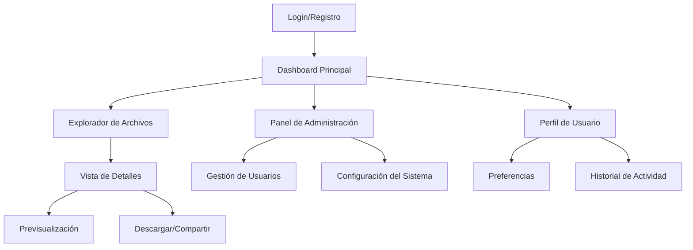

# Rediseño Completo de UI/UX - OutCom File Manager

## 1. Visión General del Producto

Rediseño integral de la aplicación OutCom transformándola en un gestor de archivos moderno, minimalista y completamente responsive. El nuevo diseño eliminará todos los estilos CSS existentes e implementará una interfaz limpia e intuitiva que priorice la claridad visual y la facilidad de navegación.

- **Objetivo Principal**: Crear una experiencia de usuario excepcional para la gestión de archivos con estándares modernos de UI/UX
- **Usuarios Objetivo**: Profesionales y empresas que requieren gestión eficiente de archivos digitales
- **Valor de Mercado**: Posicionar OutCom como una solución líder en gestión de archivos empresariales con diseño contemporáneo

## 2. Características Principales

### 2.1 Roles de Usuario

| Rol | Método de Registro | Permisos Principales |
|-----|-------------------|---------------------|
| Usuario Estándar | Registro por email | Navegar, visualizar y descargar archivos |
| Usuario Administrador | Invitación del sistema | Gestión completa de archivos, usuarios y configuración |
| Usuario Cliente | Registro con código de acceso | Acceso limitado a carpetas específicas asignadas |

### 2.2 Módulo de Características

Nuestro rediseño del gestor de archivos OutCom consistirá en las siguientes páginas principales:

1. **Dashboard Principal**: navegación principal, vista general de archivos, accesos rápidos
2. **Explorador de Archivos**: árbol de carpetas, vista de archivos, herramientas de gestión
3. **Vista de Detalles**: información del archivo, previsualización, metadatos
4. **Panel de Administración**: gestión de usuarios, configuración del sistema, reportes
5. **Perfil de Usuario**: configuración personal, preferencias, historial de actividad

### 2.3 Detalles de Páginas

| Nombre de Página | Nombre del Módulo | Descripción de Características |
|------------------|-------------------|--------------------------------|
| Dashboard Principal | Hero Section | Mostrar estadísticas de uso, archivos recientes y accesos rápidos con diseño de tarjetas minimalistas |
| Dashboard Principal | Navegación Principal | Barra de navegación horizontal con iconografía moderna y menú hamburguesa responsive |
| Dashboard Principal | Panel de Actividad | Timeline de actividades recientes con indicadores visuales claros |
| Explorador de Archivos | Árbol de Carpetas | Sidebar colapsible con estructura jerárquica, iconos SVG y estados hover/active |
| Explorador de Archivos | Vista de Archivos | Grid/lista adaptable con thumbnails, ordenamiento y filtros avanzados |
| Explorador de Archivos | Barra de Herramientas | Acciones contextuales (subir, crear, eliminar) con tooltips informativos |
| Vista de Detalles | Panel de Información | Metadatos del archivo, tamaño, fecha de modificación con tipografía clara |
| Vista de Detalles | Previsualización | Visor integrado para documentos, imágenes y videos con controles intuitivos |
| Panel de Administración | Gestión de Usuarios | Tabla responsive con acciones CRUD, filtros y paginación moderna |
| Panel de Administración | Configuración del Sistema | Formularios organizados en secciones con validación en tiempo real |
| Perfil de Usuario | Información Personal | Formulario editable con validación y feedback visual inmediato |
| Perfil de Usuario | Preferencias | Configuración de tema, idioma y notificaciones con switches modernos |

## 3. Proceso Principal

### Flujo de Usuario Estándar
1. **Acceso**: Login/registro → Dashboard principal
2. **Navegación**: Explorar carpetas → Seleccionar archivos → Ver detalles
3. **Gestión**: Subir archivos → Organizar en carpetas → Compartir/descargar
4. **Configuración**: Acceder a perfil → Modificar preferencias → Guardar cambios

### Flujo de Administrador
1. **Acceso Administrativo**: Login → Dashboard con panel admin
2. **Gestión de Sistema**: Administrar usuarios → Configurar permisos → Monitorear actividad
3. **Mantenimiento**: Revisar reportes → Optimizar almacenamiento → Configurar backups

## 4. Diseño de Interfaz de Usuario

### 4.1 Estilo de Diseño

- **Colores Primarios**: 
  - Azul Principal: #2563EB (confianza y profesionalismo)
  - Azul Secundario: #3B82F6 (acciones y enlaces)
  - Gris Neutro: #6B7280 (texto secundario)
  - Blanco: #FFFFFF (fondos principales)
  - Gris Claro: #F9FAFB (fondos secundarios)

- **Estilo de Botones**: Rounded corners (8px), estados hover con transiciones suaves, sombras sutiles

- **Tipografía**: 
  - Fuente Principal: Inter (sans-serif)
  - Tamaños: H1(32px), H2(24px), H3(20px), Body(16px), Small(14px)
  - Pesos: Regular(400), Medium(500), Semibold(600)

- **Estilo de Layout**: 
  - Grid system flexible
  - Espaciado consistente (8px base unit)
  - Navegación lateral colapsible
  - Cards con bordes sutiles y sombras

- **Iconografía**: 
  - Iconos SVG de Heroicons/Lucide
  - Tamaño estándar: 20px y 24px
  - Estilo outline para acciones secundarias, filled para primarias

### 4.2 Resumen de Diseño de Páginas

| Nombre de Página | Nombre del Módulo | Elementos de UI |
|------------------|-------------------|----------------|
| Dashboard Principal | Hero Section | Layout de 3 columnas, tarjetas con gradientes sutiles, iconos coloridos, tipografía Inter Medium |
| Dashboard Principal | Navegación Principal | Header fijo con logo, menú horizontal, avatar de usuario, fondo blanco con sombra sutil |
| Explorador de Archivos | Árbol de Carpetas | Sidebar de 280px, fondo gris claro, iconos de carpeta azules, texto gris oscuro, hover states |
| Explorador de Archivos | Vista de Archivos | Grid responsive, thumbnails 120px, nombres truncados, badges de tipo de archivo |
| Vista de Detalles | Panel de Información | Layout de 2 columnas, labels en gris medio, valores en negro, separadores sutiles |
| Panel de Administración | Gestión de Usuarios | Tabla con headers fijos, filas alternadas, botones de acción compactos, paginación moderna |
| Perfil de Usuario | Información Personal | Formulario centrado, inputs con bordes redondeados, labels flotantes, validación en verde/rojo |

### 4.3 Responsividad

- **Enfoque**: Mobile-first design con breakpoints en 640px, 768px, 1024px y 1280px
- **Navegación**: Menú hamburguesa en móviles, sidebar colapsible en tablets, navegación completa en desktop
- **Interacciones Táctiles**: Botones mínimo 44px, gestos swipe para navegación, feedback haptic en dispositivos compatibles
- **Optimización**: Lazy loading de imágenes, compresión automática, carga progresiva de contenido